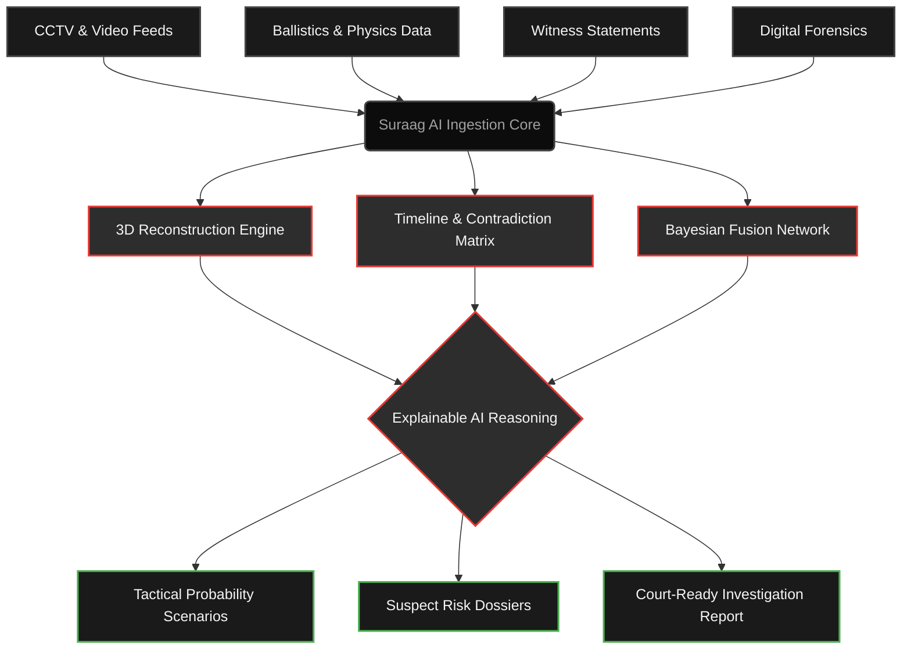
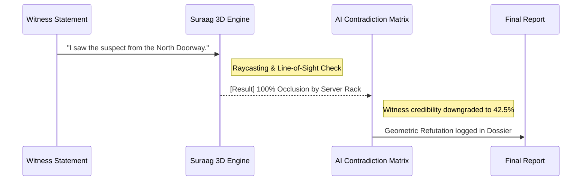

# Suraag AI: Forensic Intelligence Platform

**Suraag AI** is a state-of-the-art, mathematically rigorous forensic intelligence and reconstruction platform. Designed for law enforcement, intelligence agencies, and elite investigators, Suraag AI fuses fragmented evidence into verifiable, multi-dimensional intelligence dossiers.

Featuring a cinematic **Crime Noir + Futuristic Intelligence** interface, the platform offers deep tactical analysis, 3D ballistics reconstruction, and Explainable AI (XAI) to ensure that every deduction is transparent, mathematically sound, and courtroom-ready.

---

## 🎯 Core Capabilities

- **Bayesian Sensor Fusion:** Aggregates and correlates diverse data streams (CCTV, audio, ballistics, witness statements) into high-probability scenarios.
- **3D Crime Scene Reconstruction:** Line-of-sight raycasting and ballistic trajectory physics engines validate or refute witness statements in real-time.
- **Explainable AI (XAI) & Contradiction Matrices:** AI doesn't just give answers; it provides the exact mathematical reasoning, highlighting contradictions and degrading the credibility of conflicting data sources.
- **Sovereign Dossier Generation:** One-click export of Top Secret, courtroom-ready PDF investigation reports.

---

## ⚙️ How It Works (System Architecture)

Suraag AI operates on a multi-stage intelligence pipeline. Raw data enters the system, gets processed by physics and behavioral engines, and is ultimately compiled into actionable intelligence.



---

## 🔍 The Triangulation Process

When analyzing a specific event (e.g., a ballistic trajectory or missing evidence), Suraag AI uses geometric and physical refutation to separate truth from fiction.



---

## 🚀 Tech Stack

- **Frontend:** React 18, TypeScript, Vite
- **Styling:** Tailwind CSS (Custom "Crime Noir" Theme with glassmorphism & matte styling)
- **Icons & Graphics:** Lucide React
- **Architecture:** Client-side mock architecture ready for backend API integration (Node.js/Python)

---

## 💻 Running Locally

1. **Clone the repository**
   ```bash
   git clone https://github.com/YourUsername/Suraag-AI.git
   cd Suraag-AI
   ```

2. **Install dependencies**
   ```bash
   npm install
   ```

3. **Start the development server**
   ```bash
   npm run dev
   ```

4. **Access the Dashboard**
   Open your browser and navigate to `http://localhost:5173`.
